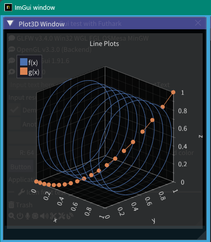
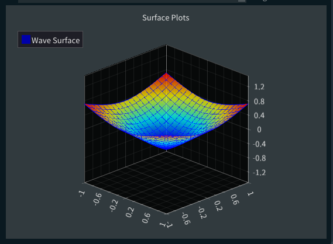

<!-- START doctoc generated TOC please keep comment here to allow auto update -->
<!-- DON'T EDIT THIS SECTION, INSTEAD RE-RUN doctoc TO UPDATE -->

- [ImGuin examples project](#imguin-examples-project)
  - [Usage: Sample program and run](#usage-sample-program-and-run)
    - [Prerequisites](#prerequisites)
    - [Build examples](#build-examples)
    - [Available libraries](#available-libraries)
    - [Screenshot (examples)](#screenshot-examples)
        - [glfw_opengl3](#glfw_opengl3)
        - [glfw_opengl3_imknobs](#glfw_opengl3_imknobs)
        - [glfw_opengl3_filedialog](#glfw_opengl3_filedialog)
        - [glfw_opengl3_imgui_toggle](#glfw_opengl3_imgui_toggle)
        - [glfw_opengl3_imguiTextSelect](#glfw_opengl3_imguitextselect)
        - [glfw_opengl3_imspinner](#glfw_opengl3_imspinner)
        - [glfw_opengl3_iconfont_viewer](#glfw_opengl3_iconfont_viewer)
        - [glfw_opengl3_image_load / sdl2_opengl3](#glfw_opengl3_image_load--sdl2_opengl3)
        - [sdl2_renderer  / sdl3_renderer  / sdl3_opengl3 / sdl3_sdlgpu3](#sdl2_renderer---sdl3_renderer---sdl3_opengl3--sdl3_sdlgpu3)
        - [glfw_opengl3_image_save](#glfw_opengl3_image_save)
        - [glfw_opengl3_jp](#glfw_opengl3_jp)
        - [glfw_opengl3_implot](#glfw_opengl3_implot)
        - [glfw_opengl3_implot3d](#glfw_opengl3_implot3d)
        - [glfw_opengl3_imnodes](#glfw_opengl3_imnodes)
        - [glfw_opengl3_imguizmo](#glfw_opengl3_imguizmo)
        - [glfw_opengl3_imColorTextEdit](#glfw_opengl3_imcolortextedit)
        - [glfw_opengl3_imgui_markdown](#glfw_opengl3_imgui_markdown)
        - [My test app movie using imguin](#my-test-app-movie-using-imguin)
  - [Cross compilation: Generating Windows application binary(\*.exe) on Linux OS](#cross-compilation-generating-windows-application-binary%5Cexe-on-linux-os)
  - [Selection backend compiler](#selection-backend-compiler)
  - [TODO](#todo)
  - [Compressing binary file](#compressing-binary-file)
  - [My tools version](#my-tools-version)
  - [Other link](#other-link)
        - [Similar project ImGui / CImGui](#similar-project-imgui--cimgui)
        - [SDL Game tutorial Platfromer](#sdl-game-tutorial-platfromer)
        - [Other link2](#other-link2)
        - [Memo](#memo)

<!-- END doctoc generated TOC please keep comment here to allow auto update -->


## ImGuin examples project

Confirmed **ImGuin** verion: **v1.92.2.1** ([Dear ImGui](https://github.com/ocornut/imgui)/[CImGui](https://github.com/cimgui/cimgui) version: 1.92.2b) (2025/08)

This project is example project to use Dear ImGui, ImPlot and so on in Nim language.  
Wrapper libraies used are here [ImGuin](https://github.com/dinau/imguin) [^notice]

[^notice]: It may be better to use the **mainstream** project [nimgl/imgui](https://github.com/nimgl/imgui) (ImGui v1.85)  
,updated project [nimgl-imgui](https://github.com/dinau/nimgl-imgui) (ImGui v1.89.9) ,sub project [nim_implot](https://github.com/dinau/nim_implot) and test project [nimgl_test](https://github.com/dinau/nimgl_test),  
or [https://github.com/daniel-j/nimgl-imgui](https://github.com/daniel-j/nimgl-imgui)(ImGui v1.91.1)

### Usage: Sample program and run

---

#### Prerequisites

---

- [Nim-2.0.16](https://nim-lang.org) or later
- Windows10 or later  
[MSys2/MinGW installed](https://www.msys2.org/): Command line tools: make, cp, rm, git, ...etc

   ```sh
   pacman -S mingw-w64-x86_64-{gcc,glfw,SDL2,sdl3} make
   ```

- Linux: Debian13 / Ubuntu families 

   ```sh
   $ sudo apt install gcc g++ make 
   $ sudo apt install lib{opengl-dev,gl1-mesa-dev,glfw3,glfw3-dev,xcursor-dev,xinerama-dev,xi-dev,sdl2-dev} git 
   ```

   - If you have Debian13 Trixie

      ```sh
      $ sudo apt install libsdl3-dev
      ``` 

#### Build examples

---

1. First clone this project,

   ```sh
   git clone https://github.com/dinau/imguin_examples
   ```

1. Install dependencies libraries,

   ```sh
   cd imguin_examples
   nimble refresh
   nimble dep
   ```

1. For instance [glfw_opengl3_base.nim](glfw_opengl3_base/glfw_opengl3_base.nim),

   ```sh
   pwd
   imguin_examples/glfw_opengl3_base
   make  # or make run
   ```

   After build, run `./glfw_opengl3_base(.exe)`  
   Compilation options depend on `./config.nims` and `./Makefile`.


1. Selecting static link or dynamic link.  
If you'd like to build executables with static link (not using `*.dll`),  
edit `./linkControl.nim` in respective example folder.  
   To not depend on any other `*.dll` files,  
   change to [^glfwStatic]
      ```nim
      const STATIC_LINK_GLFW = true   # if true, it doesn't need glfw3.dll
      const STATIC_LINK_CC   = true   # if true, it doesn't need libstd++-6.dll
      ```

[^glfwStatic]: `STATIC_LINK_GLFW = false` can only be set at Dear ImGui 1.92.0 or later

#### Available libraries 

---

Library name / C lang wrapper
- [x] [ImGui](https://github.com/ocornut/imgui) / [CImGui](https://github.com/cimgui/cimgui)
- [x] [ImPlot](https://github.com/epezent/implot) / [CImPlot](https://github.com/cimgui/cimplot)
- [x] [ImNodes](https://github.com/Nelarius/imnodes) / [CImNodes](https://github.com/cimgui/cimnodes)
- [x] [ImGuizmo](https://github.com/CedricGuillemet/ImGuizmo) / [CImGuizmo](https://github.com/cimgui/cimguizmo)
- [x] [ImGui-Knobs](https://github.com/altschuler/imgui-knobs) / [CImGui-Knobs](https://github.com/dinau/imguin/tree/main/src/imguin/private/cimgui-knobs)
- [x] [ImGuiFileDialog](https://github.com/aiekick/ImGuiFileDialog) / [CImGuiFileDialog](https://github.com/dinau/CImGuiFileDialog)
- [x] [ImGui_Toggle](https://github.com/cmdwtf/imgui_toggle) / [CimGui_Toggle](https://github.com/dinau/cimgui_toggle)
- [x] [ImPlot3d](https://github.com/brenocq/implot3d) / [CImPlot3d](https://github.com/cimgui/cimplot3d) 
- [x] [ImSpinner](https://github.com/dalerank/imspinner) / [CImSpinner](https://github.com/dinau/cimspinner) 
- [x] [ImGuiColorTextEdit](https://github.com/santaclose/ImGuiColorTextEdit) / [cimCTE](https://github.com/cimgui/cimCTE) (2025/03)
- [x] [ImGuiTextSelect](https://github.com/AidanSun05/ImGuiTextSelect) / [CImGuiTextSelect](https://github.com/dinau/CImGuiTextSelect) (2025/09)
- [ ] [ImGui_Markdown](https://github.com/enkisoftware/imgui_markdown) / [CImGui_Markdown](https://github.com/dinau/cimgui_markdown) WIP

#### Screenshot (examples)

---

These screenshots are on Windows10.

###### [glfw_opengl3](glfw_opengl3)  

---

Basic example with icon fonts


- Build

   ```sh
   pwd
   glfw_opengl3
   make        # or   nim c glfw_opengl3.nim
   ```

###### [glfw_opengl3_imknobs](glfw_opengl3_imknobs)

---

[https://github.com/altschuler/imgui-knobs](https://github.com/altschuler/imgui-knobs)  


[cimgui-knobs](src/imguin/private/cimgui-knobs) sources have been contributed from [system64MC](https://github.com/system64MC) / [PR](https://github.com/dinau/imguin/commits?author=system64MC) (2024/12).  Thank you.


```sh
pwd
glfw_opengl3_imknobs
make     # or  nim c -d:ImKnobs glfw_opengl3_imknobs.nim  
```

###### [glfw_opengl3_filedialog](glfw_opengl3_filedialog)

---

[ImGuiFileDialog](https://github.com/aiekick/ImGuiFileDialog) / [CImGuiFileDialog](https://github.com/dinau/CImGuiFileDialog)   


```sh
pwd
glfw_opengl3_filedialog
make    # or   nim c -d:ImGuiFileDialog glfw_opengl3_filedialog.nim  
```

###### [glfw_opengl3_imgui_toggle](glfw_opengl3_imgui_toggle)  

---

  

```sh
pwd
glfw_opengl3_imgui_toggle
make    # or   nim c -d:ImGuiToggle glfw_opengl3_imgui_toggle.nim  
```

###### [glfw_opengl3_imguiTextSelect](glfw_opengl3_imguiTextSelect)  

---


   ```sh
   pwd
   glfw_opengl3_imguiTextSelect
   make    # or    nim c -d:ImGuiTextSelect  glfw_opengl3_imguiTextSelect.nim  
   ```

###### [glfw_opengl3_imspinner](glfw_opengl3_imspinner)  

---

  
  

   ```sh
   pwd
   glfw_opengl3_imspinner
   make    # or    nim c -d:ImSpinner glfw_opengl3_imspinner.nim  
   ```

###### [glfw_opengl3_iconfont_viewer](glfw_opengl3_iconfont_viewer)  

---

Icon font viewer.

- [x] Magnifying glass
- [x] Incremantal search


```sh
pwd
iconFontViewer
make       # or    nim c iconFontViewer.nim  
```

###### [glfw_opengl3_image_load](glfw_opengl3_image_load) / [sdl2_opengl3](sdl2_opengl3) 

---

- [x] Image loading
- [x] Magnifying glass


   ```sh
   pwd
   glfw_opengl3_image_load
   make     # or    nim c glfw_opengl3_image_load.nim  
   ```

- sdl2 version

   ```sh
   pwd
   sdl2_opengl3
   make     # or    nim c -d:SDL sdl2_opengl3.nim  
   ```

###### [sdl2_renderer](sdl2_renderer)  / [sdl3_renderer](sdl3_renderer)  / [sdl3_opengl3](sdl3_opengl3) / [sdl3_sdlgpu3](sdl3_sdlgpu3)

---

SDL renderer backend.

- Build sdl2 renderer backend

   ```sh
   pwd
   sdl2_renderer
   make     # or    nim c -d:SDL sdl2_renderer.nim  
   ```

- Build sdl3 backend  
  See [SDL3 installation on Linux OS](https://github.com/dinau/sdl3_nim?tab=readme-ov-file#for-linux-os)

   ```sh
   pwd
   sdl3_opengl3
   make     # or    nim c -d:SDL sdl3_opengl3.nim  
   ```

- Build sdl3 renderer backend

   ```sh
   pwd
   sdl3_renderer
   make     # or    nim c -d:SDL sdl3_renderer.nim  
   ```

- Build sdl3 GPU backend

   ```sh
   pwd
   sdl3_sdlgpu3
   make     # or    nim c -d:SDL sdl3_sdlgpu3.nim  
   ```

###### [glfw_opengl3_image_save](glfw_opengl3_image_save)  

---

- [x] Image loading / saving  
It can save a screenshot as [ jpg, bmp, png or tga ] file.
- [x] Magnifying glass  


```sh
pwd
glfw_opengl3_image_save
make        # or   nim c glfw_opengl3_image_save.nim
```

###### [glfw_opengl3_jp](glfw_opengl3_jp)

---

Showing UTF-8 text and input text with a local country language.  


```sh
pwd
glfw_opengl3_jp
make        # or    nim c glfw_opengl3_jp.nim
```

If you are on Debian13 in WSL2 on Windows OS,

```sh
sudo apt install fonts-ipafont
```

###### [glfw_opengl3_implot](glfw_opengl3_implot)

---

Showing ImGui demo with ImPlot demo.  
  

```sh
pwd
glfw_opengl3_implot
make        # or    nim c -d:ImPlot glfw_opengl3_implot.nim
```

###### [glfw_opengl3_implot3d](glfw_opengl3_implot3d)

---

Showing ImPlot3D demo. WIP 




```sh
pwd
glfw_opengl3_implot3d
make       # or   nim c -d:ImPlot3D glfw_opengl3_implot3d.nim
```

###### [glfw_opengl3_imnodes](glfw_opengl3_imnodes)

---

  

```sh
pwd
glfw_opengl3_imnodes
make        # or    nim c -d:ImNodes glfw_opengl3_imnodes.nim
```

###### [glfw_opengl3_imguizmo](glfw_opengl3_imguizmo)

---

  

   ```sh
   pwd
   glfw_opengl3_imguizmo
   make        # or    nim c -d:ImGuizmo glfw_opengl3_imguizmo.nim
   ```

###### [glfw_opengl3_imColorTextEdit](glfw_opengl3_imColorTextEdit)

---

  

```sh
pwd
glfw_opengl3_imColorTextEdit
make        # or    nim c -d:ImColorTextEdit glfw_opengl3_imColorTextEdit.nim
```

###### [glfw_opengl3_imgui_markdown](glfw_opengl3_imgui_markdown)

---

WIP at this moment.


```sh
pwd
glfw_opengl3_imgui_markdown
make        # or     nim c -d:ImGuiMarkdown glfw_opengl3_imgui_markdown.nim
```

######  My test app movie using imguin

---

[](https://youtu.be/Ea0t7b9Kmq4)

### Cross compilation: Generating Windows application binary(\*.exe) on Linux OS

---

See:  
[Cross compilation to Windows, linker error (unrecognized option '-z'](https://forum.nim-lang.org/t/11302#73838)  
https://nim-lang.org/docs/nimc.html#crossminuscompilation-for-windows

For example on Linux Mint 22 and so on,

```sh
pwd
examples
cd glfw_opengl3
```

```sh
make win  
```

or

```sh
nim c -d:mingw glfw_opengl3
or 
nim c --os:windows glfw_opengl3
```

`glfw_opengl3.exe` will be generated in the current folder.

### Selection backend compiler

---

You might be able to use another C/C++ compiler,  
`Clang, vcc(Visual Studio C/C++) , zig cc`  
by changing variable `TC` in [config.nims.common](config.nims.common).

### TODO

---

- [x] Can it compile with `zig cc` ? Done. But Zig lang. is very unstable at this time. 
- [x] Whether can it use `cimgui.dll` ? (Now it can only be static link) Closed. Only be static link.
- [x] Easier compilation for SDL2 app. (2024/09) Done.
- [x] Added: ImNodes/CImNodes (2023/10) Done
- [x] Unfortunately Dear ImGui - 1.89.7 dosn't work well at this moment.(2023/07) Done. (2023/08)
- [x] Whether can it do `nimble install imguin` ? [Done (2023/09) (#Issue 13)](https://github.com/dinau/imguin/issues/13)
- [x] Add Font Awesome (Icon Font) demo.  Done (2023/04).
- [x] Can it compile with MSVC (--cc:vcc) ? Done. Except SDL2 demo. (2023/03), TODO (2024/09)
- [x] Can it compile with Clang (--cc:clang) ? Done. (2023/03)
- [x] Add SDL2 example. Done. [sdl2_opengl3](sdl2_opengl3) (2023/03)
- [x] First step has been done. (2023/03)

### Compressing binary file

---

Install `UPX` with MSys console on WindowsOS,


```sh
pacman -S mingw-w64-x86_64-upx
```

For compression exe file,

```sh
pwd
examples
cd glfw_opengl3_implot
make upx
```

```sh
                       Ultimate Packer for eXecutables
                          Copyright (C) 1996 - 2024
UPX 4.2.4       Markus Oberhumer, Laszlo Molnar & John Reiser    May 9th 2024

        File size         Ratio      Format      Name
   --------------------   ------   -----------   -----------
   7117824 ->   1217024   17.10%    win64/pe     glfw_opengl3_implot.exe      
```

Decompressing,

```sh
make dupx
```

Result in,

|                         |          GCC + UPX :  GCC |      Clang + UPX : Clang | MSVC(vcc) + UPX : MSVC    |
|------------------------:|--------------------------:|-------------------------:|--------------------------:|
|        glfw_opengl3.exe |          804 KB : 2360 KB |         720 KB : 2200 KB | 742 KB : 2070 KB          |
| glfw_opengl3_implot.exe | **1220 KB** : **7120 KB** | **940KB**  : **4200 KB** | **945 KB**  : **3810 KB** |

GCC: v14.2.0, Clang: v18.1.8, MSVC: 2022

### My tools version

---

Windows11 (main)
- **Nim Compiler Version 2.2.4**
- **GCC (Rev1, Built by MSYS2 project) 15.2.0**
- Clang version 20.1.8
- Visual Studio C++/C 2022
- git version 2.46.0.windows.1
- Make: GNU Make 4.4.1
- MSys2/MinGW tools

Linux OS: Debain 13
- **Nim Compiler Version 2.2.4**
- gcc 14.2.0
- make: GNU Make 4.4.1
- git version 2.47.3

### Other link

---

- File Dialog
   - [Cross Platform File Dialog for Dear-ImGui ](https://github.com/gallickgunner/ImGui-Addons)
   - [ImGui File Dialogs - CLI and Client Library](https://github.com/time-killer-games/libfiledialogs)
   - [A Dear ImGui based File Dialog without any extra dependencies](https://github.com/Julianiolo/ImGuiFD)
- Other
   - [Node Editor built using Dear ImGui](https://github.com/thedmd/imgui-node-editor)
- GUI
   - [nuklear-nim (Public archived)](https://github.com/zacharycarter/nuklear-nim)

- Graphical
  - [Immediate Mode Plotting](https://github.com/epezent/implot)
     

###### Similar project ImGui / CImGui

---

| Language             |          | Project                                                                                                                                         |
| -------------------: | :---:    | :----------------------------------------------------------------:                                                                              |
| **Lua**              | Script   | [LuaJITImGui](https://github.com/dinau/luajitImGui)                                                                                             |
| **NeLua**            | Compiler | [NeLuaImGui](https://github.com/dinau/neluaImGui) / [NeLuaImGui2](https://github.com/dinau/neluaImGui2)                                         |
| **Nim**              | Compiler | [ImGuin](https://github.com/dinau/imguin), [Nimgl_test](https://github.com/dinau/nimgl_test), [Nim_implot](https://github.com/dinau/nim_implot) |
| **Python**           | Script   | [DearPyGui for 32bit WindowsOS Binary](https://github.com/dinau/DearPyGui32/tree/win32)                                                         |
| **Ruby**             | Script   | [igRuby_Examples](https://github.com/dinau/igruby_examples)                                                                                     |
| **Zig**, C lang.     | Compiler | [Dear_Bindings_Build](https://github.com/dinau/dear_bindings_build)                                                                             |
| **Zig**              | Compiler | [ImGuinZ](https://github.com/dinau/imguinz)                                                                                                     |

###### SDL Game tutorial Platfromer

---


| Language             |          | SDL         | Project                                                                                                                                               |
| -------------------: | :---:    | :---:       | :----------------------------------------------------------------:                                                                                    |
| **LuaJIT**           | Script   | SDL2        | [LuaJIT-Platformer](https://github.com/dinau/luajit-platformer)
| **Nelua**            | Compiler | SDL2        | [NeLua-Platformer](https://github.com/dinau/nelua-platformer)
| **Nim**              | Compiler | SDL3 / SDL2 | [Nim-Platformer-sdl2](https://github.com/def-/nim-platformer)/ [Nim-Platformer-sdl3](https://github.com/dinau/sdl3_nim/tree/main/examples/platformer) |
| **Ruby**             | Script   | SDL3        | [Ruby-Platformer](https://github.com/dinau/ruby-platformer)                                                                                           |
| **Zig**              | Compiler | SDL3 / SDL2 | [Zig-Platformer](https://github.com/dinau/zig-platformer)                                                                                             |

###### Other link2

---

- https://github.com/SpartanJ/SOIL2  
SOIL2 is a tiny C library used primarily for uploading textures into OpenGL. 


###### Memo

---

```sh
error: assignment to 'char **' from incompatible pointer type 'const char * const*' [-Wincompatible-pointer-types]
```

```nim
type ConstCstring {.importc: const char *.} = cstring
```
